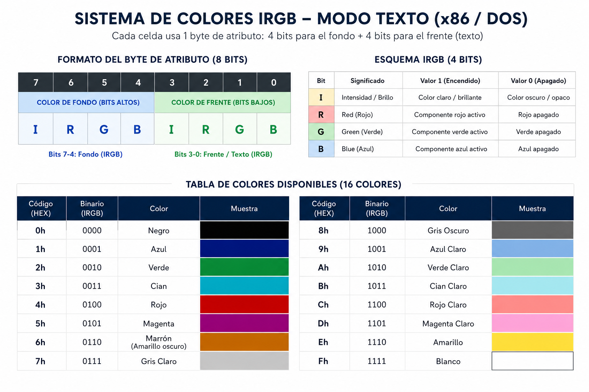

summary: Laboratorio 05 - Interrupciones de Modo Texto 
id: laboratorio-05-arquitectura-practico
categories: Ensamblador
status: Published
authors: Oscar Menjivar

# Laboratorio 5: Interrupciones de Modo Texto 

> **Autor:** Oscar Menjivar  
> **Categorías:** Ensamblador · Arquitectura x86 · Interrupciones

---

## Objetivos de Aprendizaje

Esta práctica tiene como objetivo lograr que aprendas lo siguiente:
*   **Utilizar interrupciones básicas:** Entender cómo llamar funciones del BIOS y de MS-DOS.
*   **Dibujar e interactuar en modo texto:** Configurar la pantalla, mover el cursor y dar color a nuestro texto.
*   **Leer el teclado:** Esperar y detectar pulsaciones de teclas del usuario.
*   **Manejar pantallas virtuales:** Trabajar con diferentes páginas de video.

---

## Concepto Inicial: ¿Qué es una Interrupción?

Una **interrupción** es una señal que le pide al procesador que detenga un momento lo que está haciendo y ejecute una tarea especial del sistema (como pintar un pixel, leer el teclado o terminar un programa). En ensamblador las llamamos usando la instrucción `INT` seguida del número de interrupción.

*   **Servicios del BIOS (`INT 10h`, `INT 16h`):** Funciones de muy bajo nivel integradas en la tarjeta madre de la computadora. Controlan directamente el video y el teclado.
*   **Servicios de MS-DOS (`INT 21h`):** Funciones del sistema operativo, útiles para tareas como imprimir frases completas de forma sencilla.

Comencemos a crear nuestro programa. Abre tu editor de código y prepara tu primer archivo bajo el nombre `practica[NombreApellido].asm`. En este laboratorio trabajaremos directamente con **subrutinas** (`CALL` y `RET`) para organizar nuestro código desde el principio.

---

## Paso 1: Configurar la Pantalla (Esqueleto Inicial)

Lo primero que debe hacer nuestro programa es limpiar la pantalla y configurar el modo de video correcto.

La interrupción para el video es la **`INT 10h`**. Dado que esta interrupción controla muchas cosas, debemos decirle qué acción específica deseamos realizar cargando valores en los registros:
*   El registro **`AH`** es el "registro de función". Al cargar `AH = 00h`, le indicamos al BIOS que queremos *Establecer el Modo de Pantalla*.
*   El registro **`AL`** indica qué modo queremos activar. Al cargar `AL = 03h`, seleccionamos el *Modo Texto Estándar de 80 columnas por 25 filas a color*.

### Escribe las siguientes líneas en tu archivo:
```nasm
org   100h

section .text

main:
    CALL IniciarModoTexto ; Llamamos a la subrutina para configurar la pantalla

    ; Terminar el programa
    INT 20h               ; Concluye la ejecución y regresa al sistema operativo

; ================= SUBRUTINAS =================

IniciarModoTexto:
    MOV AH, 00h           ; AH = 00h selecciona la función de configurar modo
    MOV AL, 03h           ; AL = 03h selecciona el modo de texto 80x25
    INT 10h               ; Llamamos a la interrupción de video del BIOS
    RET                   ; Regresar a donde fuimos llamados
```

---

## Paso 2: El modo texto y las coordenadas del cursor

En el modo de texto estándar (`03h`), la pantalla se comporta como una cuadrícula:
*   Tiene **80 columnas de ancho** (coordenadas en el eje X de `0` a `79`).
*   Tiene **25 filas de alto** (coordenadas en el eje Y de `0` a `24`).
*   La esquina superior izquierda es la coordenada `(0, 0)`.

Antes de imprimir algo en una posición específica, debemos mover el cursor a esa coordenada. Para ello, crearemos la subrutina `CentrarCursor` usando la función **`02h`** de la **`INT 10h`**:
*   `AH = 02h`: Código de la función de mover cursor.
*   `BH`: Número de la página de video (usaremos la página `0d` por defecto).
*   `DH`: Número de fila (usaremos la `10` para estar cerca del centro).
*   `DL`: Número de columna (usaremos la `25`).

### Agrega la subrutina y llamala en el `main`

Agrega la subrutina en la sección de subrutinas:
```nasm
CentrarCursor:
    MOV AH, 02h           ; AH = 02h selecciona la función de mover cursor
    MOV BH, 0d            ; BH = 0d indica la página de video 0 (la activa)
    MOV DH, 10            ; DH = 10 es la fila de destino (eje Y)
    MOV DL, 25            ; DL = 25 es la columna de destino (eje X)
    INT 10h               ; Llamamos al BIOS para mover el cursor
    RET
```

Modifica tu `main`:
```nasm
main:
    CALL IniciarModoTexto
    CALL CentrarCursor    ; <--- Nueva llamada agregada
    INT 20h
```


---

## Paso 3: Entender los Atributos de Color (Esquema IRGB)

Cada celda de la pantalla de texto contiene dos datos: el carácter que se muestra y su **color**. El color de cada carácter se define usando un único byte (8 bits) conocido como **byte de atributo**.

Este byte se divide en dos partes:
*   **Los 4 bits superiores (bits 4 a 7):** Controlan el **color de fondo** de la celda.
*   **Los 4 bits inferiores (bits 0 a 3):** Controlan el **color del texto (frente)**.

Cada grupo de 4 bits sigue el formato **IRGB**:
*   **`I`** (Intensidad / Brillo): Si es 1, el color es claro y brillante; si es 0, es oscuro u opaco.
*   **`R`** (Red / Rojo)
*   **`G`** (Green / Verde)
*   **`B`** (Blue / Azul)

Estas combinaciones nos permiten desplegar hasta 16 colores diferentes en la consola DOS:



### Ejemplo de cálculo del byte de atributo:
Supongamos que queremos mostrar texto en **letras blancas brillantes** (`Fh` o `1111` en binario) sobre un **fondo azul** (`1h` o `0001` en binario):
*   Fondo (bits altos): `0001`
*   Frente (bits bajos): `1111`
*   Byte resultante: `1Fh` (en binario: `0001 1111`).

### Escribir un carácter con color
Para imprimir un carácter usando este atributo, crearemos la subrutina `PintarCaracter` usando la función **`09h`** de la **`INT 10h`**:
*   `AH = 09h`: Función de escribir carácter y atributo.
*   `AL`: Código ASCII del carácter que queremos escribir (por ejemplo, `'X'`).
*   `BH`: Página de video (`0d`).
*   `BL`: Byte de atributo de color (`1Fh`).
*   `CX`: Cantidad de veces que se repetirá el carácter horizontalmente (escribiremos `1`).

### Agrega la subrutina y llamala en el `main`

Agrega la subrutina:
```nasm
PintarCaracter:
    MOV AH, 09h           ; AH = 09h selecciona escribir carácter y atributo
    MOV AL, 'X'           ; AL tiene el carácter a imprimir
    MOV BH, 0d            ; BH = página de video 0
    MOV BL, 1Fh           ; BL = Atributo calculado (Fondo azul, letras blancas)
    MOV CX, 1d            ; CX = imprimir el carácter una sola vez
    INT 10h               ; Llamamos al BIOS
    RET
```
Modifica tu `main`:
```nasm
main:
    CALL IniciarModoTexto
    CALL CentrarCursor
    CALL PintarCaracter   ; <--- Nueva llamada agregada
    INT 20h
```


> Ensambla y ejecuta tu programa. Deberías ver una letra 'X' pintada en color blanco con fondo azul cerca del centro de la pantalla. Sin embargo, notarás que la ventana se cierra casi instantáneamente.

---

## Paso 4: Detener la pantalla y Leer el Teclado

Para evitar que el programa se cierre de golpe antes de que podamos ver el resultado, debemos pausar el programa y esperar a que el usuario presione una tecla.

Usaremos la interrupción del BIOS para teclado **`INT 16h`** con la función **`AH = 00h`**, la cual detiene el programa en espera de una pulsación de tecla y retorna su código ASCII en `AL`.

### Agrega la llamada en el `main` y la subrutina abajo:

Modifica tu `main`:
```nasm
main:
    CALL IniciarModoTexto
    CALL CentrarCursor
    CALL PintarCaracter
    CALL EsperarTecla     ; <--- Nueva llamada agregada
    INT 20h
```

Agrega la subrutina:
```nasm
EsperarTecla:
    MOV AH, 00h           ; AH = 00h selecciona la función de leer teclado
    INT 16h               ; Llamar al BIOS (el programa se detiene aquí)
    RET
```

> Ensambla y ejecuta. Ahora el programa se mantendrá en pausa mostrando la 'X' coloreada en pantalla, y solo se cerrará cuando presiones cualquier tecla.

---

## Paso 5: Frases Completas y Páginas de Video

Escribir carácter por carácter con `INT 10h / AH = 09h` sería sumamente largo para textos extensos. Para imprimir frases completas usaremos la función **`09h`** de la interrupción de MS-DOS **`INT 21h`**:
*   `DX`: Dirección de memoria de inicio de la cadena de texto.
*   **Requisito:** El texto debe declararse en la sección de datos (`.data`) y terminar obligatoriamente con el carácter **`$`**.

Además, el BIOS cuenta con hasta 8 pantallas virtuales o "páginas" (0 a 7). La función de **Cambiar la Página Activa (`INT 10h / AH = 05h`)** define cuál de esas páginas se muestra en el monitor, lo que nos permite alternar entre pantallas completas instantáneamente.

### Reestructuración del Programa Final
Modificaremos el código para que en lugar de pintar una sola 'X' (eliminamos `CALL PintarCaracter`), muestre un mensaje en la página `0`, espere una tecla, cambie a la página `1`, muestre otro mensaje allí y termine.

Modifica tu archivo completo para que quede así:

```nasm
org   100h

section .data
    msgPagina0 db 'Estas en la pagina 0. Presione una tecla...$'
    msgPagina1 db 'Ahora cambiaste a la pagina 1! Fin del programa.$'

section .text

main:
    CALL IniciarModoTexto
    
    ; --- Trabajar en la Página 0 ---
    MOV BH, 0d            ; Seleccionar página de video 0 para centrar el cursor
    CALL CentrarCursor
    
    MOV AH, 09h           ; Imprimir el mensaje de la página 0 usando DOS
    MOV DX, msgPagina0
    INT 21h
    
    CALL EsperarTecla     ; Detener pantalla esperando teclado
    
    ; --- Cambiar a la Página 1 ---
    CALL CambiarAPagina1
    
    MOV BH, 1d            ; Seleccionar la página de video 1 para las funciones del cursor
    CALL CentrarCursor
    
    MOV AH, 09h           ; Imprimir el mensaje de la página 1 usando DOS
    MOV DX, msgPagina1
    INT 21h
    
    CALL EsperarTecla     ; Esperar tecla final antes de salir
    INT 20h               ; Finalizar programa

; ================= SUBRUTINAS =================

IniciarModoTexto:
    MOV AH, 00h
    MOV AL, 03h           ; Limpia pantalla y define modo texto 80x25
    INT 10h
    RET

CentrarCursor:
    MOV AH, 02h
    ; BH define en qué página queremos mover el cursor (se asigna en main)
    MOV DH, 12            ; Fila central
    MOV DL, 18            ; Columna inicial
    INT 10h
    RET

CambiarAPagina1:
    MOV AH, 05h
    MOV AL, 01h           ; Activar y mostrar la página 1 en el monitor
    INT 10h
    RET

EsperarTecla:
    MOV AH, 00h
    INT 16h               ; Pausa esperando una pulsación
    RET
```

> Ensambla y ejecuta esta versión final. Verás el flujo completo: mostrará un texto en la página 0, al presionar una tecla cambiará a la página 1 mostrando otro texto, y finalizará tras la segunda pulsación.
> 
> **Guarda este archivo final como tu primer entregable de la práctica (`practica[NombreApellido].asm`).**

---

## Resumen

### Funciones de Video (`INT 10h`)
*   **`AH = 00h` (Establecer Modo):** `AL` = Código de modo (ej. `03h` texto 80x25).
*   **`AH = 02h` (Mover Cursor):** `BH` = Página, `DH` = Fila, `DL` = Columna.
*   **`AH = 05h` (Cambiar Página Activa):** `AL` = Número de página a mostrar.
*   **`AH = 09h` (Escribir Carácter y Color):** `AL` = Carácter ASCII, `BH` = Página, `BL` = Atributo (color), `CX` = Cantidad de repeticiones.

### Funciones Auxiliares de Video
*   **`AH = 01h` (Cambiar apariencia del cursor):** `CH` = Línea inicio, `CL` = Línea fin.
*   **`AH = 03h` (Leer posición del cursor):** `BH` = Página. Retorna: `DH` = Fila, `DL` = Columna.
*   **`AH = 08h` (Leer carácter y color en cursor):** `BH` = Página. Retorna: `AL` = ASCII, `AH` = Atributo.

### Funciones de Teclado y Sistema
*   **`INT 16h / AH = 00h` (Leer Teclado):** Pausa el programa. Retorna el ASCII de la tecla en `AL`.
*   **`INT 21h / AH = 09h` (Imprimir Cadena DOS):** `DX` = Dirección del mensaje (debe finalizar con `$`).
*   **`INT 20h` (Finalizar):** Devuelve el control a DOS.

---

## Ejercicio 

A partir del código modular que construiste en el Paso 5, crea un nuevo archivo llamado `ejercicio[TuNombreTuApellido].asm` con las siguientes especificaciones:

### Desafío: El Menú Interactivo de Colores
Diseña un programa que le permita al usuario elegir el color del texto a mostrar en pantalla:
1.  **Menú Inicial:** Al arrancar el programa, limpia la pantalla en modo texto y muestra un mensaje centrado:
    `"Seleccione un color: (1) Azul o (2) Rojo: "`
2.  **Lectura:** El programa debe esperar a que el usuario presione una tecla (`INT 16h / AH = 00h`). El código ASCII de la tecla presionada quedará en `AL`.
3.  **Evaluación (Comparación):**
    *   Si el usuario presiona la tecla **`'1'`** (código ASCII `31h` o `'1'`): debe limpiar la pantalla, mover el cursor al centro de la pantalla y pintar sus iniciales (ejemplo: `E.C.`) con **letras blancas sobre fondo azul** (Atributo `1Fh`) usando `INT 10h / AH = 09h` para cada carácter.
    *   Si el usuario presiona la tecla **`'2'`** (código ASCII `32h` o `'2'`): debe hacer lo mismo pero mostrando sus iniciales con **letras amarillas sobre fondo rojo** (Atributo `4Eh`).
    *   Si presiona **cualquier otra tecla**: el programa debe finalizar directamente sin mostrar nada más.
4.  **Espera final:** Tras mostrar las iniciales coloreadas, el programa debe esperar una tecla final antes de cerrarse con `INT 20h`.

---

### Indicaciones de entrega en Moodle

Debes subir **dos archivos** con la nomenclatura estricta:
1.  `practica[NombreApellido].asm` (El código incremental final del Paso 5).
2.  `ejercicio[NombreApellido].asm` (Tu solución al desafío del Menú de Colores).
